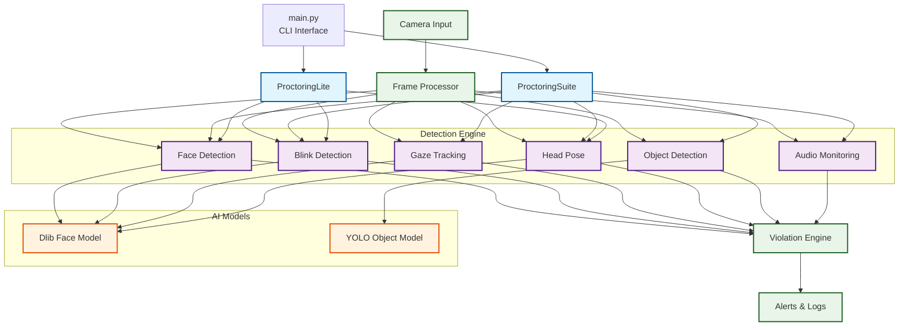

# AI Proctoring Module - System Architecture

## Simplified Architecture Diagram

## Component Details

### Core Classes
- **ProctoringSuite**: Full-featured proctoring with all detection modules
- **ProctoringLite**: Lightweight version with essential features only

### Detection Modules
- **Face Detection**: Uses Dlib for face detection and landmark extraction
- **Blink Detection**: Eye aspect ratio calculation for blink detection
- **Gaze Detection**: Pupil tracking and gaze direction analysis
- **Head Pose Estimation**: 3D head orientation using PnP algorithm
- **Mouth Tracking**: Mouth opening detection for speaking analysis
- **Object Detection**: YOLO-based suspicious object detection
- **Audio Detection**: Real-time audio amplitude monitoring

### External Dependencies
- **OpenCV**: Primary computer vision library
- **Dlib**: Face detection and facial landmark prediction
- **NumPy**: Numerical computations and array operations
- **PyAudio**: Audio input/output processing
- **YOLO Models**: Pre-trained object detection weights and configuration

### Data Flow
1. Camera captures video frames
2. Frame processor coordinates all detection modules
3. Each module performs specific analysis
4. Violation detector applies rules and thresholds
5. Results logged and displayed in real-time

### Key Features
- Modular architecture with pluggable detection components
- Real-time processing with configurable thresholds
- Comprehensive logging and violation tracking
- Both full-featured and lightweight implementations
- Automated model downloading and setup
